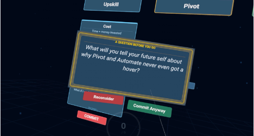
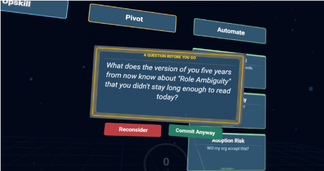
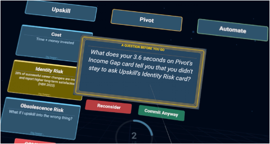
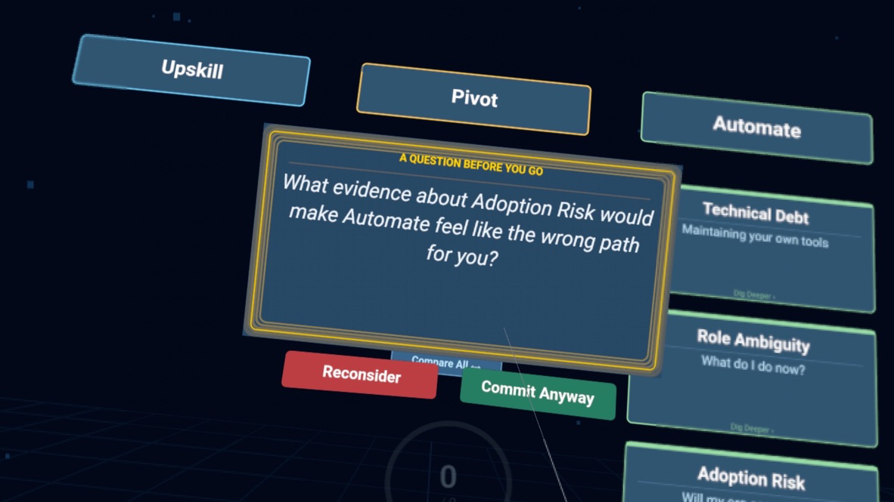

# ASTRA — Anticipatory Scaffolding via Trade-off Reflection and Arousal

ASTRA is a WebXR research artifact that operationalizes **Anticipatory Cognitive Dissonance (ACD)** — a real-time intervention that detects the formation of decision bias from a user's behavioral signals (head-gaze dwell, card reading depth, branch visitation order) and fires a session-specific dissonance-inducing question *before* commitment lock-in occurs, rather than after the decision is made. Built on the branching trade-off exploration paradigm of **FlexMind** (Yang et al., 2025 — CMU), ASTRA places the user in a VR career-decision scenario with three paths (Upskill, Pivot, Automate), instruments their exploration behavior in real time, classifies the resulting pattern against a small taxonomy of biased decision trajectories, and — if warranted — interrupts with an adaptive, LLM-generated question that references the user's own trace before they can lock in a choice. It runs in-headset on a Meta Quest 3S browser with no companion app.

This repository accompanies an academic preprint on ACD theory and is a proof-of-concept, not a product.

## ACD Loop in Action

**Intro — scenario framing**


The session opens by framing the decision: *"You're a mid-career professional. AI is disrupting your field. What's your move?"* The user is instructed to explore each path before committing to one, establishing the exploration phase that the behavioral trace is built from.

**Trigger 1 — premature pattern**



Detected pattern: **premature** — the user attempted to commit very quickly, with almost no evidence-layer reading, having never even opened the other two paths. ACD fired: *"What will you tell your future self about why Pivot and Automate never even got a hover?"*

**Trigger 2 — premature pattern**



Detected pattern: **premature** — the user attempted to commit quickly, with very little evidence-layer reading across cards, including the referenced card being left at its surface layer. ACD fired: *"What does the version of you five years from now know about 'Role Ambiguity' that you didn't stay long enough to read today?"*

**Trigger 3 — premature pattern, later in session**



Detected pattern: **premature** — a second ACD interrupt in the same session, this time citing exact dwell time on the card that was skimmed before committing. ACD fired: *"What does your 3.6 seconds on Pivot's Income Gap card tell you that you didn't stay to ask Upskill's Identity Risk card?"* Note the reference to a precise, session-specific dwell measurement rather than a generic prompt — this is the calibrated LLM layer reasoning over the live behavioral trace, not a canned message.

**Trigger 4 — confirmation pattern**



Detected pattern: **confirmation** — the user was committing to Automate after concentrating dwell and dig-deeper activity there, without weighing evidence that might count against it. ACD fired: *"What evidence about Adoption Risk would make Automate feel like the wrong path for you?"*

## Three-Layer Architecture

```
┌──────────────────────┐     ┌───────────────────────┐     ┌──────────────────────────┐
│  Layer 1              │     │  Layer 2               │     │  Layer 3                  │
│  Behavioral trace     │ ──▶ │  Pattern classifier    │ ──▶ │  Adaptive question        │
│                        │     │                        │     │  via Claude Sonnet        │
│  Head-gaze dwell per   │     │  Rule-based signals →  │     │  LLM receives the full    │
│  card, dig-deeper      │     │  confirmation /        │     │  trace + classification,  │
│  layer unlocks, branch │     │  overload / premature /│     │  generates one calibrated │
│  visitation order,     │     │  deliberate, each with │     │  question (<25 words,     │
│  commit intent timing  │     │  a confidence score    │     │  <3 s, temp 0.9) that     │
│                        │     │                        │     │  cites the user's own     │
│                        │     │                        │     │  trace; falls back to a   │
│                        │     │                        │     │  static per-pattern       │
│                        │     │                        │     │  question on timeout/error│
└──────────────────────┘     └───────────────────────┘     └──────────────────────────┘
```

- **Layer 1** lives in the frontend (`gaze.js`, `dwell.js`, `canvas.js`) and streams events (`gaze_enter`, `gaze_exit`, `card_layer_viewed`, `commit_intent`, `commit`) to the backend.
- **Layer 2** (`server/server.js`, `classifyPattern`) evaluates dwell ratio, branch visitation order, dig-deeper counts, and evidence-layer coverage against fixed thresholds to label the session's trajectory.
- **Layer 3** (`server/server.js`, `fireAcd`) sends the full trace snapshot and classification to Claude Sonnet with a 3-second timeout, asking for one trace-specific dissonance question; a static fallback question exists per pattern label if the model call fails or times out.

A given branch can only trigger one ACD interrupt, and a session fires at most three total.

## Theoretical Grounding

| Source | Contribution to ASTRA |
|---|---|
| **Satpathy, S. (2025). "Cognitive dissonance as a trigger for intervention in anticipatory AI tutors." OSF Preprint.** https://osf.io/5symn | Primary theoretical grounding — the core claim that dissonance-inducing interrupts are more effective when fired *anticipatorily*, during bias formation, rather than post-hoc after a decision is committed. |
| Yang et al. (2025), *FlexMind* (CMU) | Source paradigm for the branching trade-off exploration UI (multi-path cards, layered evidence, compare mode) that ASTRA instruments and extends into a real-time closed loop. |
| Morewedge et al. (2015) | Empirical basis for debiasing via structured, deliberate engagement with alternatives — informs the design of the three decision branches and layered card evidence. |
| Meichenbaum (1985) | Cognitive-behavioral grounding for self-instructional, reflective questioning as an intervention mechanism — informs the tone and framing of the Layer 3 prompts (curious, non-corrective, never prescriptive). |

## Run Locally

Requires Node.js and an Anthropic API key.

```bash
# Frontend
cd frontend
npm install
npm run dev          # Vite dev server; add --https for WebXR on a physical headset

# Backend (separate terminal)
cd server
npm install
```

Create `server/.env` with your Anthropic API key:

```
ANTHROPIC_API_KEY=sk-ant-...
```

Then start the backend:

```bash
npm run dev           # or: npm start
```

Open the frontend's HTTPS URL on the Meta Quest 3S browser (or a desktop browser without headset immersion) to run the decision canvas. For on-device testing, the frontend must connect to the backend via your machine's LAN IP (not `localhost`), since `localhost` on the headset resolves to the headset itself.

## Status

**Proof-of-concept.** The ACD loop — behavioral instrumentation, pattern classification, and adaptive LLM-generated interrupts — has been verified end-to-end on a Meta Quest 3S browser. A controlled empirical study measuring the effect of anticipatory vs. post-hoc dissonance prompts on decision quality is future work.
